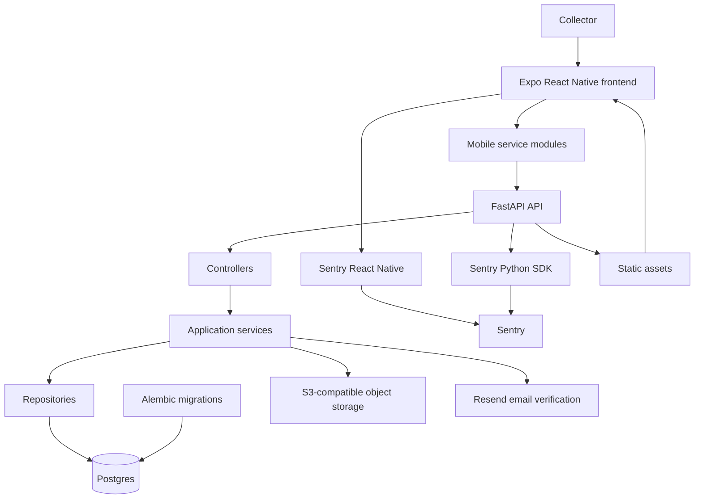

# Toybox

Toybox is a mobile app for toy collectors to manage accounts, profiles, toy
collections, discovery, and nearby opportunity signals in one place. The stack is
an Expo React Native frontend backed by a FastAPI service, Postgres, Alembic
migrations, object storage uploads, email verification, and Sentry observability.

## Product

Toybox helps collectors:

- Create and verify an account.
- Maintain a collector profile.
- Add toys with images.
- Browse collection and discovery surfaces.
- View odds and recent catch context.
- Upload toy and avatar media through presigned object storage URLs.

See [PRODUCT.md](PRODUCT.md) for the product rules and user-facing behavior.

## Schema



## Stack

- `apps/mobile`: Expo React Native app with Expo Router, NativeWind, service
  modules, hooks, and Sentry React Native.
- `apps/api`: FastAPI app with controller, service, repository, and Pydantic
  model layers.
- `apps/migrations`: standalone Alembic project for Postgres schema changes.
- `docker-compose.yml`: local Postgres service.
- `.mise.toml`: pinned tools, local defaults, and project tasks.

Deeper implementation notes live in [ARCHITECTURE.md](ARCHITECTURE.md) and
[INTEGRATIONS.md](INTEGRATIONS.md).

## Prerequisites

- `mise`
- Docker with Docker Compose

Node, pnpm, Python, and uv versions are pinned through mise.

## Setup

```bash
mise install
mise run install
```

The mise defaults are enough for local development. Copy `.env.example` to
`.env` when you need credentials or overrides for database, API URLs, S3, Resend,
JWT, or Sentry settings.

## Run Locally

Start Postgres and apply migrations:

```bash
mise run db:up
mise run db:migrate
```

Run the full stack:

```bash
mise run dev
```

Run services separately:

```bash
mise run dev:api
mise run dev:mobile
```

Run the full stack for Expo Go on a physical phone over LAN:

```bash
EXPO_LAN_IP=192.168.1.20 mise run dev:lan
```

Replace `192.168.1.20` with the computer LAN IP that the phone can reach. In
WSL, use the Windows host LAN IP rather than `localhost`.

For Android emulator networking:

```bash
EXPO_PUBLIC_API_URL=http://10.0.2.2:8000 mise run dev:mobile
```

## Local URLs

- FastAPI: `http://localhost:8000`
- API health: `http://localhost:8000/health`
- API database health: `http://localhost:8000/health/db`
- Sentry debug route: `http://localhost:8000/sentry-debug`
- Postgres: `localhost:5432`

## Configuration

Common local settings:

- `DATABASE_URL`: FastAPI and Alembic Postgres connection string.
- `EXPO_PUBLIC_API_URL`: mobile client API base URL.
- `API_PUBLIC_URL`: public API URL used when generating links.
- `AWS_ACCESS_KEY_ID`, `AWS_SECRET_ACCESS_KEY`, `AWS_REGION`,
  `AWS_BUCKET_NAME`: S3 upload credentials.
- `S3_ENDPOINT_URL`, `S3_PUBLIC_BASE_URL`: optional S3-compatible endpoint and
  public URL overrides.
- `RESEND_API_KEY`, `RESEND_FROM_EMAIL`: account verification email delivery.
- `JWT_SECRET_KEY`, `JWT_ALGORITHM`, `JWT_ACCESS_TOKEN_EXPIRE_MINUTES`: auth
  token settings.
- `SENTRY_DSN`, `SENTRY_SEND_DEFAULT_PII`, `SENTRY_TRACES_SAMPLE_RATE`,
  `SENTRY_ENABLE_LOGS`: FastAPI Sentry settings.
- `EXPO_PUBLIC_SENTRY_DSN`, `SENTRY_AUTH_TOKEN`: mobile Sentry settings.

## Checks

```bash
mise run test
mise run lint
```

For documentation-only changes, runtime tests are usually unnecessary, but keep
commands, paths, and environment names synchronized with the repo.

## Database

Default local credentials:

- database: `toybox`
- user: `toybox`
- password: `toybox`

Reset local data:

```bash
mise run db:reset
```

Migration commands:

```bash
MESSAGE="create users" mise run db:revision
mise run db:migrate
mise run db:current
```

## Project Docs

- [PRODUCT.md](PRODUCT.md): product behavior and domain rules.
- [ARCHITECTURE.md](ARCHITECTURE.md): backend layering, database access, and
  mobile import conventions.
- [INTEGRATIONS.md](INTEGRATIONS.md): mobile/API integration patterns.
- [apps/api/README.md](apps/api/README.md): API notes.
- [apps/mobile/README.md](apps/mobile/README.md): mobile app notes.
- [apps/migrations/README.md](apps/migrations/README.md): migration project
  commands.
